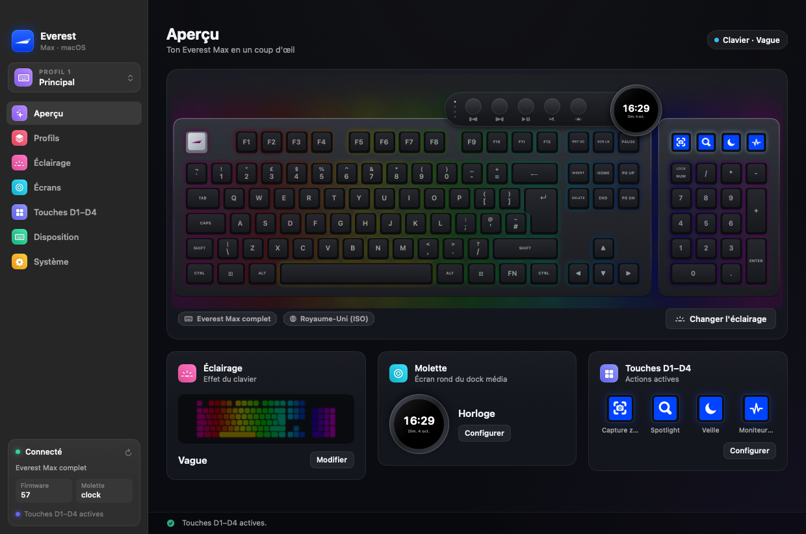
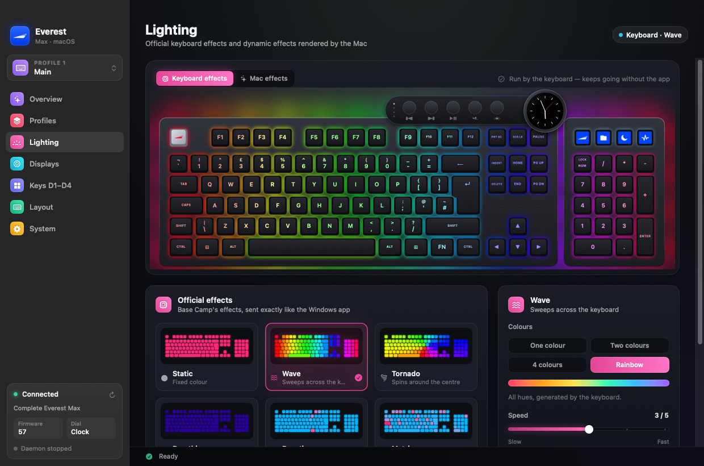
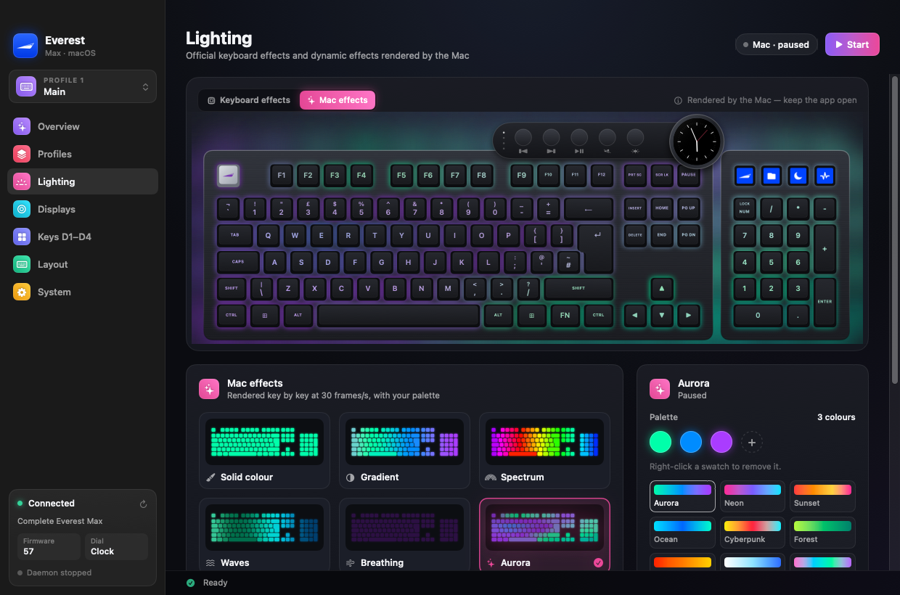
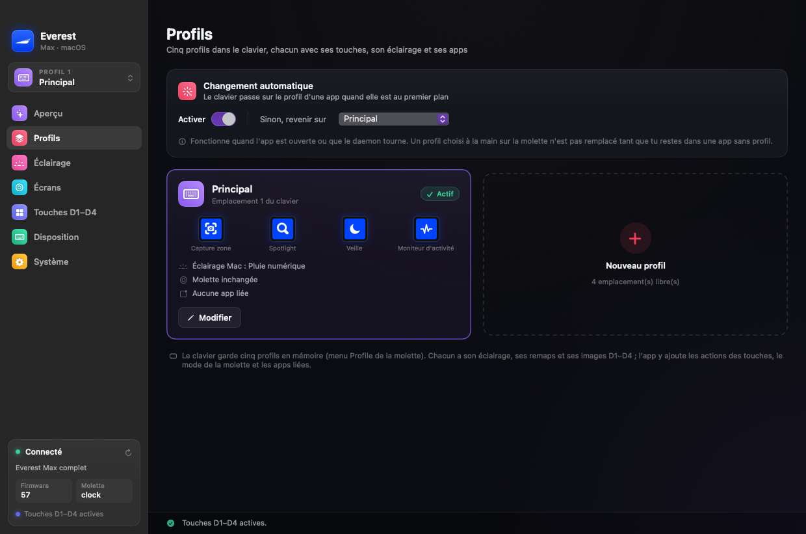
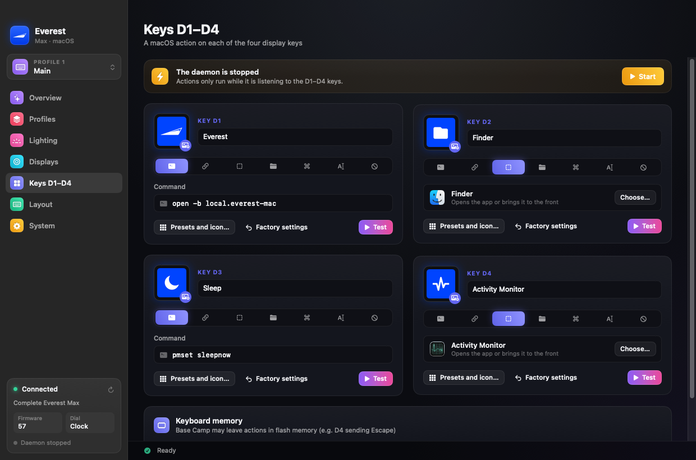
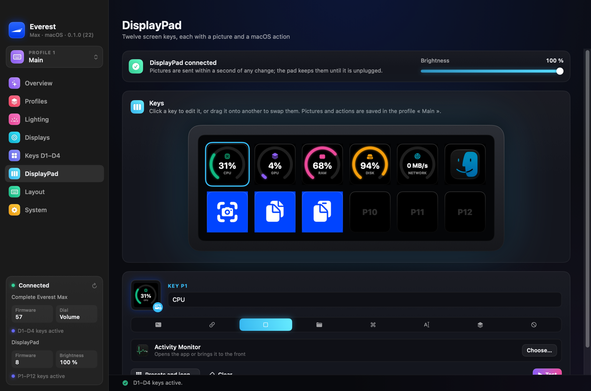

# Everest for macOS

An unofficial companion app for the **Mountain Everest Max** keyboard on macOS.
Mountain only ships *Base Camp* for Windows; this talks to the keyboard
directly (IOKit HID — no driver, no Wine, no Python) and gives its extra
hardware a job.



> **Not affiliated with Mountain / 360 Service Agency GmbH.** "Mountain",
> "Everest" and "Base Camp" are their trademarks. Use at your own risk — see
> [Safety](#safety).

## What it does

- **RGB lighting** — the keyboard's built-in effects, sent exactly like Base
  Camp does (Static, Wave, Tornado, Breathing, Reactive, Matrix, Yeti), plus a dozen
  per-key effects rendered on the Mac (aurora, plasma, ripples, fire, digital
  rain, …) with your own palettes, and per-key painting.
- **Display keys D1–D4** — ready-made icons, any installed app's icon, or your
  own image, each with an action: shell command, URL, open/bring forward an
  app, key combo, typed text. Factory pictures and actions can be restored.
- **DisplayPad** — the separate twelve-key Mountain DisplayPad, with the same
  pictures (presets, app icons, your images) and actions as D1–D4, per
  profile, plus its brightness; keys can also show live CPU, GPU, RAM,
  disk, network, volume or the time; drag a key onto another to swap them.
  No driver, no root.
- **Dial screen** — clock, CPU / GPU / RAM / disk / network / volume gauges,
  or a custom image.
- **Profiles** — the keyboard's five hardware profiles, each with its own
  lighting, D1–D4 setup, DisplayPad keys and dial mode; link an app to a
  profile and the keyboard and pad switch when that app comes to the front,
  or switch from any key (next, previous or a given profile).
- **Layouts** — the keyboard layout is read from the firmware (10 layouts, ANSI
  and ISO) and the drawing, legends and effects follow it.
- **Menu-bar app** — keeps working with the window closed, reconnects when the
  keyboard is unplugged and replugged, can open at login.
- A **command-line tool** (`everest`) for everything above.

| | |
|---|---|
|  |  |
|  |  |
|  | |

> The interface (window, menu-bar menu, messages) is available in **English,
> French, German, Spanish, Italian, Portuguese, Norwegian, Swedish, Danish,
> Finnish, Korean and Hebrew** — the languages of the layouts the keyboard
> ships with (Hebrew mirrors the window right to left). It follows the system language, and can be
> changed in *System → Language* or from the menu-bar icon. Adding a language
> takes one file — see [Translating](#translating).

## Supported hardware

| Device | USB id | Status |
|---|---|---|
| Mountain Everest Max (keyboard + numpad + media dock) | `3282:0001` | Developed and tested on a **UK-ISO** board, **firmware 57 — the only firmware Everest will talk to** (see [Firmware](#firmware)) |
| Other Everest Max layouts (US, FR, DE, IT, Nordic, ES, PT, Hebrew, Korean) | `3282:0001` | Detected and drawn from Base Camp's own tables, **not tested on hardware** |
| Everest Core | `3282:0001` | The same keyboard without the modules; **untested** |
| Mountain DisplayPad | `3282:0009` | Tested on **firmware 8** (the only one Everest writes to); see [docs/DISPLAYPAD.md](docs/DISPLAYPAD.md) |
| Everest 60, Makalu mice, MacroPad | other ids | **Not supported** — different protocols |

If you own a layout or a model that is not verified, a report (even just the
output of `everest info`) helps a lot.

## Firmware

Everest only works with keyboards running **firmware 57**, the version it was
developed and tested on. When it sees any other version — older *or* newer —
it **sends nothing to the keyboard** (no lighting, pictures, actions or
clock), the window shows an explanation, and the menu-bar menu says so. The
check is in `Keyboard.init`, so the `everest` command-line tools and the background
daemon obey it too; only the read-only `everest info` and `everest sniff` still work, and reports
the version. A keyboard whose version cannot be read is treated the same way.

Everest does **not** update the firmware itself. Mountain only distributes the
update through *Base Camp for Windows*, and flashing is the one operation that
can leave a keyboard unusable if it goes wrong; it can't be tested safely
here. To update: plug the keyboard into a Windows PC, run Base Camp's firmware
update, then reconnect it to the Mac — Everest picks it up by itself.

Support for another firmware is added only after someone has tested it on real
hardware: change `Keyboard.supportedFirmware` (and run `everest selftest`).

## Safety

This tool writes to the keyboard. Lighting, profiles, clock and actions are
ordinary settings. **Sending pictures to the display keys or the dial uses the
same mechanism as the firmware update.** The sequence implemented here is the
one Base Camp's own SDK uses (checked in its disassembly), but:

- it has only been run on one keyboard and one firmware version, which is
  why Everest refuses every other firmware (see [Firmware](#firmware));
- do not unplug the keyboard during a picture transfer (about 20 s per key);
- if something goes wrong, `everest recover` or unplugging and replugging the
  keyboard clears the usual cases (nothing is lost, settings stay in the
  keyboard).

The software is provided as is, without warranty (see [LICENSE](LICENSE)).

## Install

Requirements: macOS 13 or later; for building, the Xcode command-line tools
(Swift 5.9+).

### Build from source (recommended)

```sh
git clone <this repository> && cd everest-mac
./make-app.sh --install      # builds Everest.app and copies it to /Applications
open /Applications/Everest.app
```

A locally built app is not quarantined, so macOS does not warn about it.
`./install.sh` additionally installs the `everest` command-line tool to
`~/bin`.

### Prebuilt app

The release `.zip` is **not signed or notarised** (that needs a paid Apple
developer account). macOS will refuse to open it the first time:

1. Move `Everest.app` to `/Applications`.
2. Right-click it → **Open** → **Open**, or run
   `xattr -dr com.apple.quarantine /Applications/Everest.app`.

`./make-app.sh --zip` builds such a zip.

### First launch

Key combinations and typed text are sent as synthetic key presses, which macOS
only allows after you grant **Accessibility**: System Settings → Privacy &
Security → Accessibility → add **Everest.app**. If Everest is already ticked
but D1–D4 do nothing, the entry is stale (it belonged to an older build):
select it, remove it with **−**, and add it again. The app shows a banner when
the permission is missing.

To open at login, tick **System → Launch Everest at login**
(install the app in `/Applications` first).

## Using it

- **Overview** — the board as it is, live. **Profiles** — the five profiles and
  linked apps. **Lighting** — keyboard effects and Mac effects.
  **Displays** — dial mode, clock, images. **Touches D1–D4** — actions, presets,
  icons. **Layout** — detected layout and the matching macOS input source.
  **System** — daemon, login item, recovery.
- Closing the window keeps Everest running in the menu bar (profile switcher,
  lighting, D1–D4 on/off). ⌘Q or the menu's *Quit Everest* quits for real.
- Defaults for D1–D4 are the factory behaviour (Base Camp's own pictures):
  D1 opens this app, D2 Finder, D3 sleeps the Mac (`pmset sleepnow`!), D4
  Activity Monitor. Change them on the **Keys D1–D4** page.
- The keyboard also stores its own shortcut for each D key (Windows-style
  `Win+1…`, which become ⌘1… on a Mac). The app overwrites them with a no-op;
  set `"keepFlashActions": true` in the config to keep them.

Configuration lives in `~/.config/everest-mac/` (`config.json`, `icons/`,
`daemon.log`).

## Command line

```sh
everest info                   # attached modules, profile, detected layout
everest rgb wave-rainbow --speed 75 --direction left
everest effect aurora --colors 00ffaa,008cff,aa3cff
everest icon 1 picture.png     # send a picture to D1 (converted to 72×72)
everest mode cpu               # dial shows the CPU load
everest pad image 3 logo.png   # picture on DisplayPad key 3 (until it is unplugged)
everest pad brightness 50      # DisplayPad backlight
everest listen                 # run the D1–D4 and DisplayPad actions (the app does this for you)
everest recover                # clear a stuck picture transfer
everest help                   # everything else
```

## Testing

```sh
swift test                     # unit tests, no keyboard needed (also run by CI)
everest selftest               # talks to the real keyboard, read-only
everest selftest --lighting    # also switches the lighting slot and restores it
everest selftest --upload 4    # also sends a test picture to D4, then resets D4
everest selftest --pad         # the DisplayPad, read-only
everest selftest --pad --draw  # also a test pattern on its key 12 (RAM only), then restores it
```

The unit tests pin the exact bytes sent to the keyboard (lighting packets,
picture descriptor, resets, queries), the ten layouts (key sets, geometry,
legends), the configuration (including the migration from the single-profile
file), the profile switching rules and the effect renderer. `selftest` checks
the conversation with the device: that every query gets its own answer even
when the daemon is talking too, that the handle can be reopened, and — with the
flags — that lighting and picture uploads still work. Please run
`swift test` and `everest selftest` before sending a pull request.

## Troubleshooting

| Symptom | Likely cause |
|---|---|
| D1–D4 do nothing, the menu-bar icon shows a warning | Accessibility permission missing or stale — see [First launch](#first-launch) |
| A D key types digits or opens apps by itself | The keyboard's own shortcut is active: *Keys D1–D4 → Erase leftover actions* or `everest clear-buttons` |
| "Firmware not supported" covers the window | The keyboard is not on firmware 57 — see [Firmware](#firmware) |
| The `\|` key left of Z prints nothing | macOS treats the board as ANSI: *Layout → Remap the ISO key* |
| The keyboard stops answering after an interrupted upload | `everest recover`, or replug |
| The DisplayPad stays black | Plug it straight into the Mac (some hubs do not power its screen), and let the app or `everest listen` run: the pad shows nothing until a host switches it on |

## Limitations

- Everest Max only; one keyboard at a time.
- The interface is translated into twelve languages; the command-line help and
  the daemon log are English only.
- Mac-rendered effects need the app to keep running; built-in effects run in
  the keyboard.
- Layout shapes and legends other than UK come from Base Camp's tables and are
  unverified on hardware.

## How it works

The protocol was worked out by disassembling and decompiling Base Camp 1.9.10
(for interoperability) and cross-checking it with the community
[BaseCamp-Linux](https://github.com/ramisotti13-eng/BaseCamp-Linux) notes. The
details — packet formats, lighting encodings, profiles, picture upload,
layouts — are in [docs/PROTOCOL.md](docs/PROTOCOL.md).

## Translating

Every piece of interface text is looked up by key — `tr("section.lighting.title")`
— never written inline. The catalogs are plain Swift dictionaries in
`Sources/everest/Strings/Strings.<code>.swift` (one file per language);
English is the fallback. To add a language:

1. Add a case to `Language` in `Sources/everest/L10n.swift` (and its native name
   and catalog).
2. Copy `Strings.en.swift` to `Strings.<code>.swift`, rename the dictionary and
   translate the values. Keep the positional placeholders (`%1$@`, `%2$@`) —
   they can be reordered but not dropped.
3. Run `swift test`: `LocalizationTests` fails if a key or a placeholder is
   missing in any language.

The new language shows up in *System → Language* and in the menu-bar menu.

## Contributing

Bug reports and pull requests are welcome, especially: translations, results
from other layouts or an Everest Core, and anything that makes the picture
upload safer. Please say which keyboard layout and firmware you have.

## Credits and legal

- [BaseCamp-Linux](https://github.com/ramisotti13-eng/BaseCamp-Linux) —
  hardware-validated protocol work this project learned from (that project is
  under its own licence, GPL v3 + non-commercial; none of its code is included).
- Mountain's Base Camp supplied the protocol semantics, the layout tables'
  keycap text and the four default display-key pictures, which are included so
  the app can show what the keyboard shows after a reset. The app icon is built
  from Mountain's logo (`tools/make-icon.swift`; replace `assets/AppIcon.icns`
  and `Sources/everest/MountainMark.swift` to use another). The same mark is
  used in the sidebar, the menu-bar icon and on the Esc key. These remain Mountain's property and will be removed on
  request.
- Mountain's DisplayPad SDK (MIT) — the DisplayPad protocol was read from it;
  see [docs/DISPLAYPAD.md](docs/DISPLAYPAD.md).
- Code: [MIT](LICENSE).
